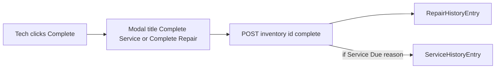

# Complete Service modal + Service History databank

## Context

- **Service-scheduled downs** are driven by maintenance automation: open tasks set `Inventory.downReason` to strings like `Service Due: 50hr Service` (see `[src/lib/maintenanceAutomation.ts](j:/Rentel/src/lib/maintenanceAutomation.ts)` — `SERVICE_REASON_PREFIX` and task `reason` construction).
- The Techs complete flow lives in `[public/techs.html](j:/Rentel/public/techs.html)`: `openCompleteModal` never updates the `<h3 id="complete-modal-title">` (default **“Complete Repair”**), and `POST /api/inventory/:id/complete` in `[src/routes/inventory.ts](j:/Rentel/src/routes/inventory.ts)` appends only `[RepairHistoryEntry](j:/Rentel/prisma/schema.prisma)` via `[src/lib/repairHistory.ts](j:/Rentel/src/lib/repairHistory.ts)`.

**Terminology:** You referred to “Service Required”; the codebase uses **“Service Due:”** as the canonical prefix. Detection should match the backend (`isServiceDueReason` logic) so behavior stays consistent.

## 1. Modal title (and optional button label)

In `[public/techs.html](j:/Rentel/public/techs.html)`:

- Add a small helper, e.g. `isServiceDueDown(row)`, that returns true when `String(row.downReason || "").trim().startsWith("Service Due:")` (keep in sync with exported server helper below).
- In `**openCompleteModal`**: set `#complete-modal-title` to **“Complete Service”** when `isServiceDueDown(row)`, otherwise **“Complete Repair”**.
- In `**closeModal`** for `complete-modal-backdrop`: reset the title to the default **“Complete Repair”** (same pattern as other modals resetting text).
- Optionally mirror the same wording on the submit button while the modal is open (e.g. “Complete Service” vs “Complete”) for consistency.

## 2. Service History databank (schema + library)

- **Prisma model** in `[prisma/schema.prisma](j:/Rentel/prisma/schema.prisma)`: add `ServiceHistoryEntry` mirroring the audit fields you need for a completed service event, for example:
  - `id`, `inventoryId` (FK to `Inventory`), `details` (snapshot of the service context, e.g. prior `downReason` / completion summary), `techName`, `repairHours`, `createdAt`.
- **Migration**: add a new SQL migration under `prisma/migrations/` (after editing schema, run `prisma migrate dev` in implementation phase).
- **Library** `[src/lib/serviceHistory.ts](j:/Rentel/src/lib/serviceHistory.ts)` (new): follow the pattern of `[src/lib/repairHistory.ts](j:/Rentel/src/lib/repairHistory.ts)` — `ensureServiceHistorySchema` (if you keep raw SQL bootstrap like repair history) *or* rely on Prisma-only inserts; prefer **Prisma `create`** for inserts/queries if the rest of the app uses Prisma for this model, to avoid duplicate schema drift.

## 3. Record on complete (server)

- **Export** `isServiceDueReason` from `[src/lib/maintenanceAutomation.ts](j:/Rentel/src/lib/maintenanceAutomation.ts)` (or extract shared `SERVICE_REASON_PREFIX` + `isServiceDueReason` to a tiny shared module imported by both maintenance and inventory — either is fine; avoid duplicating the prefix string).
- In `**POST .../complete`** in `[src/routes/inventory.ts](j:/Rentel/src/routes/inventory.ts)`, after a successful update, **if** `isServiceDueReason(existing.downReason)`, append a **ServiceHistoryEntry** with:
  - `details` capturing the completed service context (e.g. include the prior `downReason` text),
  - `techName`, `repairHours`, `createdAt` aligned with the existing repair-history completion.
- **Keep** the existing `appendRepairHistoryEntry` call unless you explicitly want a single timeline only; default is **both** (repair timeline unchanged + new service databank).

## 4. API + Techs UI to read the databank

- **GET**  `/api/inventory/:id/service-history` (tech-auth, same as repair history): return recent `ServiceHistoryEntry` rows for that unit.
- **Techs UI**: extend the existing history experience so techs can see the databank:
  - **Lightweight approach:** In the same modal used by `openRepairHistoryModal`, add a **“Service history”** subsection (or a second table) below repair history; fetch `/repair-history` and `/service-history` together and render both (empty state when no service rows).
  - Wire the same “History” button on Down/Returned rows to load both lists.

## 5. Files to touch (concise)

| Area                  | Files                                                                                                                                  |
| --------------------- | -------------------------------------------------------------------------------------------------------------------------------------- |
| Modal copy            | `[public/techs.html](j:/Rentel/public/techs.html)`                                                                                     |
| Model + migration     | `[prisma/schema.prisma](j:/Rentel/prisma/schema.prisma)`, `prisma/migrations/...`                                                      |
| Write path + read API | `[src/routes/inventory.ts](j:/Rentel/src/routes/inventory.ts)`, new `[src/lib/serviceHistory.ts](j:/Rentel/src/lib/serviceHistory.ts)` |
| Shared detection      | `[src/lib/maintenanceAutomation.ts](j:/Rentel/src/lib/maintenanceAutomation.ts)` (export) or small shared module                       |

## Data flow (high level)

## Note on edge cases

- If `downReason` is a compound string that does **not** start with `Service Due:`, the server will not treat it as service-due (same as today’s `isServiceDueReason` in maintenance automation). If you need compound reasons detected differently, that would be a separate rules change.

